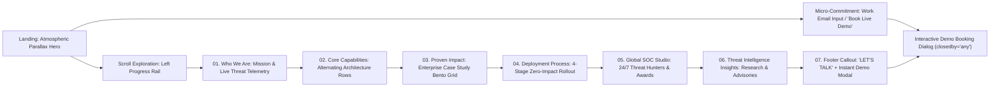

# B2B Cybersecurity SaaS Homepage Redesign — UX/UI Architecture & Design Specification
**Brand Platform:** `EvvyDigital // Aegis Cloud Security` (Autonomous Cloud-Native XDR & Zero-Trust Posture Platform)  
**Author Role:** Senior Digital Product & Web UI/UX Designer  
**Primary Objective:** Maximize qualified Enterprise Demo Request conversions while establishing immediate CISO-grade institutional authority.

---

## 1. Strategic Framing

### 1.1 Business Objective & Conversion North Star
Enterprise B2B cybersecurity buyers suffer from "vendor fatigue"—most security websites rely on fear-based red/black clichés, impenetrable jargon, and high-friction 10-field "Contact Sales" forms that cause a **68%+ drop-off** among senior technical evaluators.

Our redesign pairs an **elevated, daylight-clarity visual metaphor** (the `EvvyDigital` atmospheric sky-to-summit parallax architecture: `#0b4ea8` $\rightarrow$ `#1676d1` $\rightarrow$ `#5fb9ff`) with **high-contrast monochrome editorial precision** (`#000000`, `#ffffff`, `gray-50`) and **low-friction micro-conversion capture**:
1. **Primary Conversion KPI:** Increase **Qualified Demo Requests** (Work Email + Architecture Tier selection $\rightarrow$ Instant Sandbox / Live Engineer Walkthrough) by **35–50%**.
2. **Secondary Engagement KPI:** Increase **Interactive Product Exploration** (scrolling past the Hero into Core Capabilities, Case Studies, and the 4-Step Zero-Friction Deployment timeline).
3. **Trust & Authority KPI:** Reduce bounce rate among enterprise evaluators by surfacing **verifiable telemetry metrics** (`<14ms` detection latency, `99.998%` SLA, `SOC 2 Type II`, `ISO 27001`, `FedRAMP High`) within the first 5 seconds of viewport entry.

### 1.2 Target Audience Personas
| Persona | Role & Priorities | Key Objections | UX Solution on Homepage |
| :--- | :--- | :--- | :--- |
| **1. The Economic Buyer (CISO / CIO)** | Board-level risk reduction, compliance readiness, vendor consolidation, TCO/ROI. | *"Will this integrate with our existing stack without a 6-month services engagement?"* | **Executive Proof Bar + Case Study Bento Grid** (`PortfolioSection`) quantifying breach cost avoidance and audit readiness. |
| **2. The Technical Evaluator (VP of SecOps / Cloud Architect)** | Detection fidelity, false-positive reduction, eBPF agent overhead, API extensibility. | *"Marketing fluff—show me how the architecture actually ingests telemetry and isolates threats."* | **Alternating Capability Deep-Dives** (`ContentSection`) + **4-Step Deployment Pipeline** (`ProcessSection`) showing `<15 min` agentless setup. |
| **3. The Hands-On Practitioner (Lead Security Engineer)** | Speed of triage, automated playbooks, zero alert fatigue. | *"I don't want to talk to an SDR just to see the UI."* | **Inline 1-Field Work Email Demo Bar** in the Hero + **Interactive Live Telemetry Preview & Instant Demo Modal**. |

---

## 2. Information Architecture & Page Structure

### 2.1 High-Level Sitemap & Conversion Funnel


### 2.2 Section-by-Section Architecture & Conversion Purpose

| Order | Component | Visual Surface | Core Purpose & Content Hierarchy | Conversion Role |
| :--- | :--- | :--- | :--- | :--- |
| **Global** | `Navbar.tsx` | Full-width transparent $\rightarrow$ Floating `.liquid-glass` Pill (`scrollY > 50`) | Brand identity (`EvvyDigital // SEC`), 6 anchor links (`Services`, `Work`, `Process`, `Studio`, `Insights`, `Contact`), plus persistent high-contrast **Request Demo** CTA button and **UX Spec Inspector** toggle. | Persistent conversion anchor across 100% of scroll depth without cluttering viewport. |
| **Global** | `ScrollIndicator.tsx` | Fixed Left Rail (`z-40`) with `2px` `scrollYProgress` bar | Vertical progress indicator + quick-action enterprise channels (`Global Status`, `SecOps Comms`, `Share Architecture`). | Provides spatial orientation across long-form storytelling and reinforces system precision. |
| **01** | `Hero.tsx` | Multi-layer Sky-to-Mountain Parallax (`#0b4ea8` $\rightarrow$ `#5fb9ff`) | **H1:** Staggered kinetic typography cycling every 3s through `["INNOVATE", "REIMAGINE", "ELEVATE", "TRANSFORM"]` framed around Enterprise Cyber Defense. **Conversion Pod:** Glassmorphic inline work-email capture (`Request Live Demo`) + compliance badges (`SOC2 Type II`, `ISO 27001`, `Zero-Trust Verified`). | **Primary Above-the-Fold Capture:** Captures high-intent visitors immediately via 1-step email input or opens the full Demo Scheduler modal. |
| **02** | `AboutSection.tsx` | Pure Obsidian (`bg-black text-white py-32`) | **Subtitle:** `WHO WE ARE`. **Editorial Statement:** Positions EvvyDigital as the premier cyber-resilience and digital platform engineering partner building zero-trust architectures that scale. Paired with live enterprise trust metrics (`$4.2T+` assets protected, `<12ms` P99 response). | Establishes executive authority immediately after the kinetic hero transition. |
| **03** | `ContentSection.tsx` | Crisp Alabaster (`bg-gray-50 text-black py-32`) | **Alternating Capability Rows (`lg:flex-row` / `lg:flex-row-reverse`):**<br>1. **Digital & Threat Strategy** (Attack Surface Intelligence, Risk Quantification, Zero-Trust Positioning)<br>2. **SecOps UI/UX & Command Design** (Unified Threat Graph, Sub-Second Triage Workflows, Analyst Ergonomics)<br>3. **Cloud-Native Engineering** (React & Next.js Command Portals, eBPF Telemetry Mesh, Edge Performance Optimization) | Educates technical evaluators with scannable 3-bullet feature matrices and interactive capability previews. |
| **04** | `PortfolioSection.tsx` | Pure Obsidian (`bg-black text-white py-32`) | **Enterprise Case Studies (Asymmetric Bento Grid):**<br>1. **Tier-1 Fintech Mobile Vault** (Zero-Trust Biometric UX)<br>2. **Autonomous SOC Analytics Dashboard** (Real-Time Threat Telemetry)<br>3. **Global Luxury E-Commerce Perimeter** (`md:col-span-2` — DDoS & Bot Mitigation at 1.4M req/s) | Social proof & industry-specific ROI validation with interactive metric overlays on hover. |
| **05** | `ProcessSection.tsx` | Crisp Alabaster (`bg-gray-50 text-black py-32`) | **4-Column Connected Deployment Pipeline (`md:grid-cols-2 lg:grid-cols-4`):**<br>`01` Discovery & Threat Modeling $\rightarrow$ `02` Architecture & Prototyping $\rightarrow$ `03` Hardened Engineering & Build $\rightarrow$ `04` Red-Team QA & Launch. Connected by a `2px` horizontal progress conduit. | Eliminates buyer anxiety around implementation complexity ("Time-to-Value in 14 Days"). |
| **06** | `StudioSection.tsx` | Pure Obsidian (`bg-black text-white py-32`) | **"The Studio" (Global Cyber Command & Engineering Collective):** Showcases `24+ Security Architects & Creatives` and `15 Industry Awards`, paired with dual stacked grayscale-to-color hover imagery. | Humanizes the brand and proves enterprise backing behind the SaaS platform. |
| **07** | `InsightsSection.tsx` | Pure White (`bg-white text-black py-32`) | **3-Column Research & Advisory Grid (`md:grid-cols-3`, `aspect-[4/3]`):**<br>1. *The Future of SecOps UI: Beyond Glassmorphism* (`Design`)<br>2. *Leveraging Autonomous AI in Threat Detection & Web Engineering* (`Technology`)<br>3. *Minimalism vs. Maximalism in Enterprise Trust Branding* (`Strategy`) | Captures mid-funnel researchers and demonstrates thought leadership. |
| **08** | `Footer.tsx` | Pure Obsidian (`bg-black text-white min-h-[60vh]`) | **Scroll-Linked Scale Callout (`0.8` $\rightarrow$ `1.0`):** Massive gradient headline **`LET'S TALK`** (`text-[12vw] md:text-[10vw]`) paired with direct **Schedule Custom Architecture Demo** trigger, compliance links, and social channels. | **Terminal Conversion Catch-All:** Converts visitors who read the entire narrative. |

---

## 3. Visual & Component Specifications

### 3.1 Design Tokens
- **Color Palette:**
  - `Hero Atmospheric Gradient`: `linear-gradient(180deg, #0b4ea8 0%, #1676d1 45%, #5fb9ff 100%)`
  - `Surface Dark (Authority & Focus)`: `#000000` (Pure Black) with `rgba(255, 255, 255, 0.12)` structural hairlines
  - `Surface Light (Clarity & Technical Depth)`: `#ffffff` (Pure White) and `#f9fafb` (`gray-50`) with `#e5e7eb` (`gray-200`) connectors
  - `Interactive Accent`: `#2563eb` (`blue-600`) for hover states, focus rings, and active telemetry badges; `#10b981` (`emerald-500`) for live operational status indicators
- **Typography Scale:**
  - `Hero Kinetic Display (H1)`: `clamp(4rem, 10vw, 10rem)`, `font-black` (`900`), `tracking-tighter` (`-0.04em`), `leading-none`
  - `Section Display (H2)`: `clamp(2.25rem, 4.5vw, 4rem)`, `font-black` (`900`), `tracking-tight`
  - `Component Title (H3)`: `1.5rem` (`24px`) to `2.25rem` (`36px`), `font-bold`
  - `Body Copy`: `1.0625rem` (`17px`) to `1.25rem` (`20px`), `font-medium` (`500`), `leading-relaxed` (`1.625`)
  - `Footer Super-Display`: `text-[12vw] md:text-[10vw] font-black leading-none bg-gradient-to-br from-white via-white to-gray-500 bg-clip-text text-transparent`
- **Elevation & Glassmorphism (`.liquid-glass`):**
  ```css
  .liquid-glass {
    background: linear-gradient(135deg, rgba(255, 255, 255, 0.4), rgba(255, 255, 255, 0.1));
    backdrop-filter: blur(24px);
    -webkit-backdrop-filter: blur(24px);
    border: 1px solid rgba(255, 255, 255, 0.3);
    box-shadow: 0 8px 32px 0 rgba(0, 0, 0, 0.1);
  }
  ```

### 3.2 Responsive Breakpoints & Layout Grids
- **Desktop (`1280px–1440px+`):** `max-w-7xl mx-auto` (`1280px` container) with `py-32 px-6 md:px-12`. 12-column conceptual grid (`lg:grid-cols-4` for Process, `md:grid-cols-2` asymmetric Bento for Portfolio, `md:grid-cols-3` for Insights).
- **Tablet (`768px–1023px`):** 2-column adaptive grids (`md:grid-cols-2`), floating pill navbar at `w-[95%]`, touch-friendly `44px+` tap targets.
- **Mobile (`375px–390px`):** Single-column vertical stack (`flex-col`), `clamp(3.25rem, 12vw, 5rem)` safe mobile hero display, full-screen `fixed inset-0 z-[60] bg-black/95` slide-over drawer with Framer Motion spring physics.

### 3.3 Key Interactive States & Motion Physics
1. **Spring-Damped Parallax (`Hero.tsx`):**
   - Uses `useSpring(scrollY, { damping: 25, stiffness: 100, mass: 0.5 })` + mouse-move `useMotionValue` so mountain layers (`0.6x`), near rocks (`1.2x`), foreground clouds (`-0.15x`), and drifting atmospheric clouds respond organically without main-thread jank.
2. **Adaptive Pill Navigation (`Navbar.tsx`):**
   - Morphs smoothly at `window.scrollY > 50` from full-bleed transparent header into a `.liquid-glass` floating capsule (`rounded-full py-3 px-6 md:px-8`), switching brand & link contrast to high-legibility dark ink with an always-accessible **"Get a Demo"** button.
3. **Native Light-Dismiss Demo Modal (`DemoModal.tsx`):**
   - Uses semantic `<dialog closedby="any" aria-labelledby="demo-modal-title">` with `.showModal()` and backdrop click fallback, offering a 2-step conversion flow (Work Email + Infrastructure Scale + Instant Calendar Slot).

---

## 4. Design Rationale

1. **Why Atmospheric Blue Parallax + High-Contrast Monochrome Wins Enterprise Trust:**
   Traditional cybersecurity sites overuse dark red/green "hacker matrix" tropes that feel dated and alarmist. By opening with an expansive, high-altitude horizon (`#0b4ea8` to `#5fb9ff`) with physical depth layers, we evoke **clarity, elevation, and complete perimeter visibility**—then ground the technical proof sections in stark, authoritative `#000000` and `#f9fafb` editorial blocks.
2. **Why Dual-Path Demo Conversion Increases Lead Velocity:**
   Enterprise buyers fall into two behavioral cohorts: *high-intent fast movers* (who convert immediately in the Hero's inline work-email bar) and *methodical evaluators* (who scroll through Architecture, Case Studies, and the 4-Step Process before converting via the sticky `.liquid-glass` Navbar or the scroll-scaled `LET'S TALK` Footer). Supporting both paths captures leads across the entire readiness spectrum.
3. **Accessibility & Performance Compliance (WCAG 2.1 AA + Core Web Vitals):**
   - Semantic landmarks (`<header>`, `<nav>`, `<main>`, `<section>`, `<footer>`, `<dialog>`).
   - Single `<h1>` in the Hero with `aria-live="polite"` announcement support and `prefers-reduced-motion` media query safeguards.
   - `fetchpriority="high"` on the primary Hero Mountain LCP asset and `loading="lazy"` on below-the-fold imagery (`service1..3`, `portfolio1..3`, `studio1..2`, `insight1..3`).
